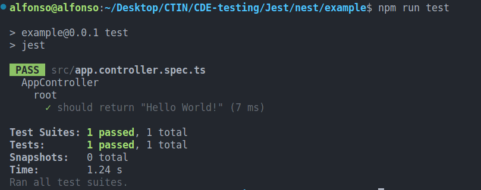

# Nest.js 
Nest ([Nest.js](https://nestjs.com/)) is a framework for building efficient, scalable [Node.js](https://nodejs.org/) server-side applications. It uses progressive JavaScript, is built with and fully supports [TypeScript](http://www.typescriptlang.org/)
### Prerequisites
- Latest Nest version: `"@nestjs/common": "^10.0.0",`
- Please make sure that [Node.js](https://nodejs.org/) (version >= 16) is installed on your operating system.

#### Installation
To scaffold the project with the Nest CLI, run the following commands.
```sh
$ npm i -g @nestjs/cli
$ nest new project-name
```

> **HINT:** To create a new TypeScript project with stricter feature set, pass the `--strict` flag to the `nest new` command.

#### Running the application
Once the installation process is complete, you can run the following command at your OS command prompt to start the application listening for inbound HTTP requests:
```sh
$ npm run start
```

Once the application is running, open your browser and navigate to `http://localhost:3000/`. You should see the `Hello World!` message.

To watch for changes in your files, you can run the following command to start the application:
```bash
$ npm run start:dev
```

This command will watch your files, automatically recompiling and reloading the server.

## Testing: Implementing Jest
[Jest](https://github.com/facebook/jest) is provided as the default testing framework by Nest. It serves as a test-runner and also provides assert functions and test-double utilities that help with mocking, spying, etc.
#### Installation
To get started, first install the required package:
```bash
$ npm i --save-dev @nestjs/testing
```

### Default Unit Test:
The boilerplate created by the Nest CLI already implements a unit test for our "Hello World!" which should look like this:
```tsx
import { Test, TestingModule } from '@nestjs/testing';
import { AppController } from './app.controller';
import { AppService } from './app.service';

describe('AppController', () => {
	let appController: AppController;

	beforeEach(async () => {
		const app: TestingModule = await Test.createTestingModule({
			controllers: [AppController],
			providers: [AppService],
		}).compile();

		appController = app.get<AppController>(AppController);
	});

	describe('root', () => {
		it('should return "Hello World!"', () => {
			expect(appController.getHello()).toBe('Hello World!');
		});
	});
});
```

Such test can be tested by running: 
```sh
npm run test
```

Which should print something as follows: 


### HTTP Verb Test: 
Based on the structure of the default unit test, let's provide examples for testing different HTTP verbs.

> __Disclaimer__:  The following examples are based on my research. I have not yet implemented them in a real-world application.
#### DELETE Example:
Assuming you have a controller with a delete endpoint (e.g., `deleteItem` in `ItemController`):
```tsx
describe('ItemController', () => {
  // ... (similar setup)

  describe('deleteItem', () => {
    it('should delete an item by ID', async () => {
      const itemId = 'someItemId';

      // Assuming you have a method in your service to delete an item
      const deletedItem = await itemController.deleteItem(itemId);

      // Assert the result
      expect(deletedItem).toBeDefined();
      // Add more specific assertions based on your item structure or the expected result of deletion
    });
  });
});
```
**Description:** This example tests the `deleteItem` endpoint of the `ItemController` to ensure that it successfully deletes an item identified by its ID. It checks if the method in the service responsible for item deletion is functioning correctly.

#### GET Example:
Assuming you have a controller with a get endpoint (e.g., `getItem` in `ItemController`):
```tsx
describe('ItemController', () => {
  // ... (similar setup)

  describe('getItem', () => {
    it('should get an item by ID', async () => {
      const itemId = 'someItemId';

      // Assuming you have a method in your service to get an item
      const foundItem = await itemController.getItem(itemId);

      // Assert the result
      expect(foundItem).toBeDefined();
      expect(foundItem.id).toBe(itemId);
      expect(foundItem.name).toBe('Expected Item Name');
      // Add more specific assertions based on your item structure
    });
  });
});
```
**Description:** This example tests the `getItem` endpoint of the `ItemController` to ensure that it successfully retrieves an item by its ID. It checks if the method in the service responsible for item retrieval is functioning correctly.

#### PATCH Example:
Assuming you have a controller with a patch endpoint (e.g., `updateItem` in `ItemController`):
```tsx
describe('ItemController', () => {
  // ... (similar setup)

  describe('updateItem', () => {
    it('should update an item', async () => {
      const itemId = 'someItemId';
      const updatedData = {
        name: 'Updated Item Name',
        // Add other properties as needed
      };

      // Assuming you have a method in your service to update an item
      const updatedItem = await itemController.updateItem(itemId, updatedData);

      // Assert the result
      expect(updatedItem).toBeDefined();
      expect(updatedItem.name).toBe('Updated Item Name');
      // Add more specific assertions based on your item structure
    });
  });
});
```
**Description:** This example tests the `updateItem` endpoint of the `ItemController` to ensure that it successfully updates an item identified by its ID with the provided data. It checks if the method in the service responsible for item updating is functioning correctly.

#### POST Example:
Assuming you have a controller with a post endpoint (e.g., `createItem` in `ItemController`):
```tsx
describe('ItemController', () => {
  // ... (similar setup)

  describe('createItem', () => {
    it('should create a new item', async () => {
      const newItemData = { /* your new item data */ };

      // Assuming you have a method in your service to create an item
      const createdItem = await itemController.createItem(newItemData);

      // Assert the result or check the side effects
      expect(createdItem).toBeDefined();
      // Add more assertions as needed
    });
  });
});
```
**Description:** This example tests the `createItem` endpoint of the `ItemController` to ensure that it successfully creates a new item with the provided data. It checks if the method in the service responsible for item creation is functioning correctly.
