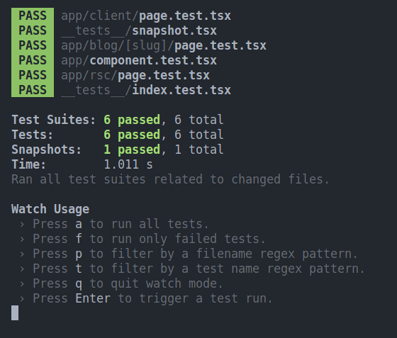

# Next.js 
[Next.js](https://nextjs.org/) is a React framework for building full-stack web applications. React Components are used to construct user interfaces, while Next.js provides additional features and optimizations.

### Prerequisites
- Node.js (Minimum version: 16)
- Supported operating systems: macOS, Windows (including WSL), and Linux.

#### Automatic Installation
To initiate a project, run:
```sh
npx create-next-app my-app
```

During installation, respond to the prompts:
```sh
What is your project named? my-app
Would you like to use TypeScript? No / Yes
Would you like to use ESLint? No / Yes
Would you like to use Tailwind CSS? No / Yes
Would you like to use `src/` directory? No / Yes
Would you like to use App Router? (recommended) No / Yes
Would you like to customize the default import alias (@/*)? No / Yes
What import alias would you like configured? @/*
```

After the prompts, create-next-app will create a folder with your project name and install the required dependencies.

#### Running the application

1. Run `npm run dev` to start the development server.
2. Visit `http://localhost:3000` to view your application.
3. Edit `app/layout.tsx` (or `pages/index.tsx`) file and save it to see the updated result in your browser.

## Testing: Implementing Jest

[Jest](https://github.com/facebook/jest) and React Testing Library are frequently used together for **Unit Testing**.

There are 3 different ways of implementing Jest in Next.js:
1. Quickstart 
2. Setting up Jest (with the Rust Compiler)
3. Setting up Jest (with Babel)

In this tutorial, we'll follow the Quickstart as the most straightforward way to work with Jest in Next.js.

> Note: Using the Quickstart allows you to omit the previously mentioned Automatic Installation.

#### Installation

You can use `create-next-app` with the [with-jest](https://github.com/vercel/next.js/tree/canary/examples/with-jest) example to quickly get started with Jest and React Testing Library:
```bash
npx create-next-app@latest --example with-jest with-jest-app
```

#### ### Default Unit Test:
The boilerplate created should include a unit test that checks if the `<Home />` component successfully renders a heading:
```js
/**
 * @jest-environment jsdom
 */
import { render, screen } from '@testing-library/react'
import Home from '@/pages/index'

describe('Home', () => {
  it('renders a heading', () => {
    render(<Home />)

    const heading = screen.getByRole('heading', {
      name: /welcome to next\.js!/i,
    })

    expect(heading).toBeInTheDocument()
  })
})
```

This test can be executed by running:
```sh
npm run test
```

Which should display something similar to:


Optionally, this example includes a [snapshot test](https://jestjs.io/docs/snapshot-testing) to keep track of any unexpected changes to your `<Home />` component:
```js
import { render } from '@testing-library/react'
import Home from '../pages/index'
 
it('renders homepage unchanged', () => {
  const { container } = render(<Home />)
  expect(container).toMatchSnapshot()
})
```

